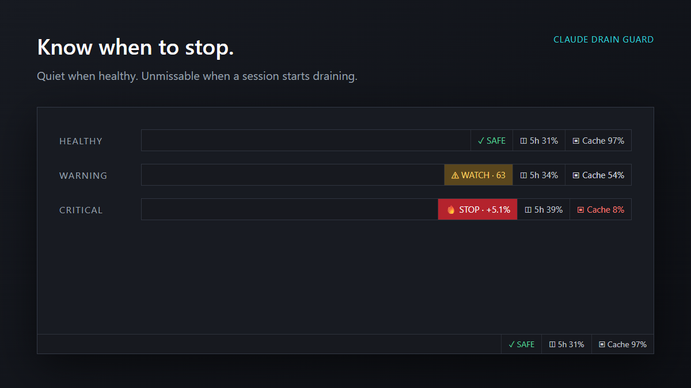
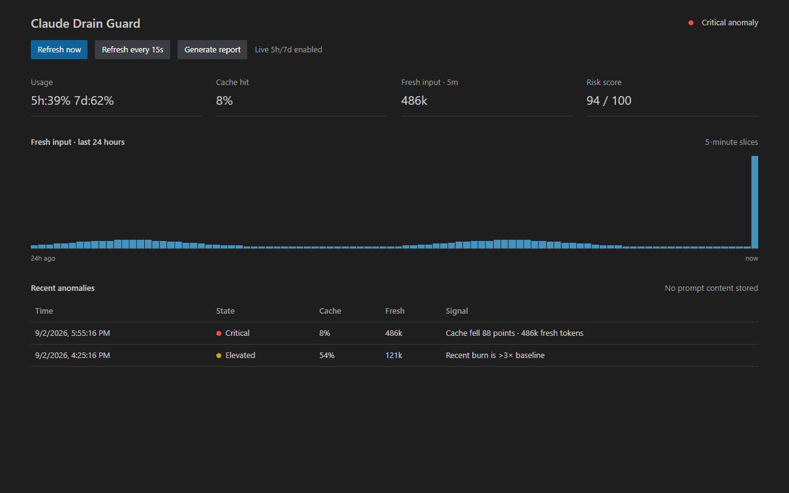
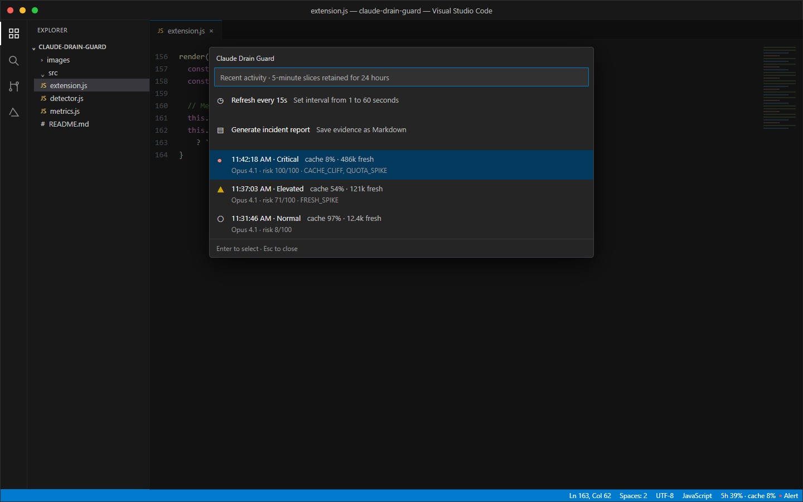

# Claude Drain Guard

A zero-dependency VS Code extension that watches Claude Code locally, aggregates five-minute slices, and tells you to stop after the first anomalous prompt—before the next few prompts drain the session.

## Install or update

Install **Claude Drain Guard 0.8.1** from the Visual Studio Marketplace, or open **Extensions: Install from VSIX...** in VS Code and select the `0.8.1` VSIX package.

Marketplace releases are immutable: an uploaded `0.8.0` package cannot be replaced. If you installed or uploaded `0.8.0`, use `0.8.1` for the finalized dashboard and cache-collapse calibration.

## Status bar

Five-hour usage and cache hit stay visible in a small item on the right. A separate state indicator sits beside it:

- Normal: `5h 31% · cache 97%` followed by a blue dot
- Elevated: the same metrics followed by a yellow dot
- Critical: the same metrics followed by a red dot and `Alert`

Click the item and select **Refresh every Ns** to set a 1–60 second background refresh interval. The default is 15 seconds; file changes still trigger an immediate incremental read.

Quota display adapts to the available data: Claude.ai 5h/7d, 5h-only, stale quota, or local API/Bedrock usage. Cache hit remains visible in every active mode. The colored indicator is independent of the quota percentage: only cache, fresh-token, change-point, and sudden-drain anomaly signals change it.

## Signals

- Per-turn cache hit and fresh-token spike
- Cache cliff (large hit-rate drop between turns)
- Median/MAD robust anomaly score, resistant to outliers
- Short EWMA acceleration against the user's own rolling baseline
- Page-Hinkley change points and one-sided CUSUM for sustained drain
- Multivariate risk scoring across fresh input, cache write, output, cache deficit and cache cliffs
- Baselines segmented by model, project and context bucket, so a warm-to-cold cache collapse is compared with the correct historical workload
- Deterministic bootstrap 30-minute burn forecast with p50/p90 bounds
- Hysteresis and notification cooldown to suppress alert flapping
- Compact status bar: `5m fresh tokens · cache hit · risk score`
- Compact right-side usage item plus a tiny blue/yellow/red state indicator
- Compact native hover for the current slice; detailed evidence stays in VS Code Quick Pick
- Acknowledgement-required critical alert after the first anomalous turn
- Automatic local Markdown incident report with recent turns and five-minute slices

## Dashboard

Click the status item or run **Claude Drain Guard: Open Dashboard**. The native-themed dashboard shows 5h/7d usage, cache hit, five-minute fresh input, risk score, a 24-hour slice chart, and recent anomalies. It also provides one-click live-usage enablement, refresh interval controls, and incident reports. Prompt and response content is never shown.

## Performance

- Event-driven reads target only the JSONL file that changed
- Configurable 1–60 second checks touch only known active files
- Full session discovery is asynchronous and runs once per minute
- Appended data is streamed in 256 KB chunks; incomplete JSONL tails are preserved
- State writes are asynchronous, atomic, and coalesced only after new data

No prompts, source code, credentials, or telemetry are collected. Local anomaly monitoring remains independent of the network. Live 5h/7d usage is enabled by default: the adapter reads the existing Claude OAuth token in memory, makes at most one minimal 1-token Haiku request per five minutes, reads only rate-limit response headers, never persists the token, and falls back safely to local detection on failure. This request consumes a tiny amount of quota and can be disabled with `claudeDrainGuard.authoritativeQuota.enabled`.

## Development

Open this folder in VS Code and press `F5`. Run `node --test test/*.test.js` for the detector tests.

To create a Marketplace package, increment `version` in `package.json` for every release, then run `npx @vscode/vsce package --no-dependencies`. Never reuse a version that has already been uploaded.

## Commands

- `Claude Drain Guard: Open Dashboard`
- `Claude Drain Guard: Show Details`
- `Claude Drain Guard: Generate Incident Report`
- `Claude Drain Guard: Mute Alerts for 15 Minutes`
- `Claude Drain Guard: Reset Baseline`

## Privacy and security

See [PRIVACY.md](PRIVACY.md) and [SECURITY.md](SECURITY.md). This is a community project and is not affiliated with or endorsed by Anthropic.
